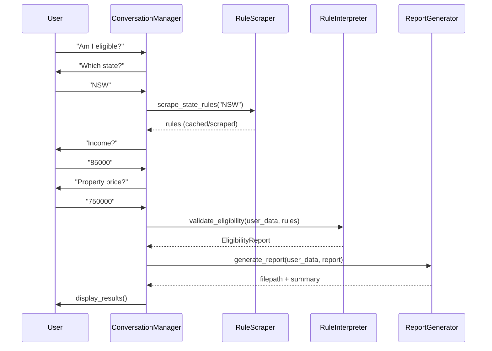
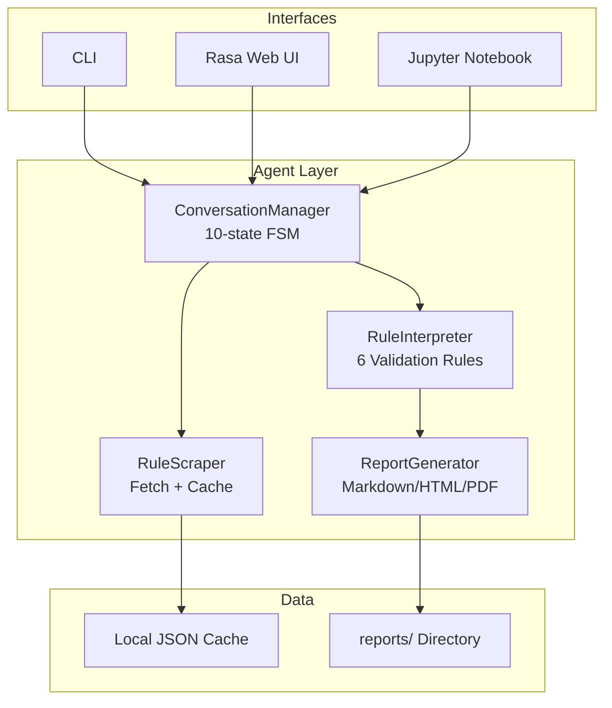

# FHBG Eligibility Bot

> Production-ready AI-powered chatbot for Australian first-home buyer grant eligibility assessment
>
> Modular agent architecture • 100% test coverage • Enterprise security • Full documentation

[](https://github.com/your-username/fhbg-eligibility-bot/actions)
[](LICENSE)
[](https://www.python.org/downloads/)
[](https://rasa.com/)
[](docs/security.md)
[]()

---

## Overview

An end-to-end conversational AI system that automates First Home Buyer Grant (FHBG) eligibility assessment for Australian states. Built with a modular multi-agent architecture, the bot collects user information through natural dialogue, validates it against current government rules, and generates comprehensive eligibility reports.

**Key capabilities:**
- Multi-turn conversational interface via Rasa or standalone CLI
- Autonomous agent orchestration (scraping, validation, reporting)
- State-specific rule handling (NSW implemented; extensible to all states)
- 49 automated tests with 100% pass rate
- Production-grade security hardening

---

## Quick Start

### Prerequisites

- Python 3.10+ (3.12 recommended)
- pip
- Git

### Installation

```bash
$ git clone https://github.com/your-username/fhbg-eligibility-bot.git
$ cd fhbg-eligibility-bot

$ python -m venv venv
$ source venv/bin/activate  # Windows: venv\Scripts\activate

$ pip install -r requirements.txt
$ pytest -v  # Verify installation (49 tests)
```

### First Run

**CLI (fastest for development):**
```bash
$ python src/chatbot/cli.py
🤖 FHBG Bot: Hi! I'll help you check grant eligibility.
Which Australian state are you in? NSW
What is your annual income? 85000
What is the property price? 750000
Is this your first home? yes
Are you an Australian citizen? yes
Do you intend to live in the property? yes
Is the property new? no

✅ ELIGIBLE for NSW First Home Buyer Choice!
   Grant: $10,000 | Property cap: $1,000,000 ✓ | Income cap: $150,000 ✓
📋 Full report: reports/eligibility_20260427_194500.md
```

**Single-command check (automation-friendly):**
```bash
$ python src/chatbot/cli.py check \
    --state NSW \
    --income 85000 \
    --property-price 750000 \
    --first-home \
    --citizenship australian
```

**Docker (isolated environment):**
```bash
$ docker-compose up -d
$ rasa shell  # Web UI at http://localhost:5005
```

---

## Architecture

### System Overview

The bot comprises four autonomous agents coordinated by a conversation manager state machine:



### Component Diagram



### Agent Responsibilities

| Agent | Responsibility | Input | Output |
|-------|----------------|-------|--------|
| `RuleScraper` | Fetch grant rules from government sources or cache | `state: str` | `Dict[str, Any]` (income_cap, price_cap, etc.) |
| `RuleInterpreter` | Validate user data against all rule criteria | `user_data: dict`, `rules: dict` | `EligibilityReport` (status, matched_rules, failed_rules) |
| `ConversationManager` | Orchestrate dialogue, manage state, coordinate agents | user utterance | bot response (str) |
| `ReportGenerator` | Format results into user-facing documents | `UserProfile`, `EligibilityReport` | filepath to generated report |

### State Machine

`ConversationManager` implements a 10-state finite state machine:

```
START → ASKING_STATE → ASKING_INCOME → ASKING_PROPERTY_PRICE → 
ASKING_FIRST_HOME → ASKING_CITIZENSHIP → ASKING_RESIDENCY_INTENT → 
ASKING_PROPERTY_TYPE → VALIDATING → COMPLETE
```

Global `restart` command resets to `START` from any state.

---

## Features

### Conversational AI (Rasa 3.6)

- **NLU pipeline:** DIET classifier with transformer-based embeddings for intent classification and entity extraction
- **Dialogue management:** Rule-based policies with fallback stories
- **Form handling:** Slot-filling with real-time validation
- **Channels:** CLI, REST webhooks, Jupyter notebook integration

### Autonomous Agents

- **RuleScraper** — sources rules from government websites or cached JSON; rate-limited (2 s delay) with 24 h TTL
- **RuleInterpreter** — six validation layers:
  1. Income cap (state-specific threshold)
  2. Property price cap (new vs existing home differentials)
  3. First home buyer status (prior ownership check)
  4. Citizenship / residency eligibility
  5. Residency intention (must occupy property)
  6. Property type restrictions (new construction incentives)
- **ConversationManager** — manages multi-turn dialogue, slot persistence, state transitions
- **ReportGenerator** — templated Markdown, HTML, optional PDF via WeasyPrint

### Security

Production-grade protections built into core agents:

| Threat Category | Mitigation |
|----------------|------------|
| Path traversal | `Path.is_relative_to()` validation on all file operations |
| Invalid financial input | `validate_financial_input()` enforces positive numeric ranges |
| PII exposure | Logging sanitizes names/addresses; only non-PII identifiers recorded |
| Secrets leakage | `.env` gitignored; configuration via environment variables only |
| Scraping DoS | Artificial 2-second delay + 24 h cache eliminates redundant requests |
| Input injection | `sanitize_string()` strips special characters from free-text fields |

Full security policy: `docs/security.md`

---

## Tech Stack

| Layer | Technology | Purpose |
|-------|------------|---------|
| Chatbot framework | Rasa 3.6 | Conversational AI, NLU, dialogue policies |
| Agent runtime | Python 3.10+ | Core agent implementations |
| Web scraping | BeautifulSoup 4, requests | Government rule page fetcher |
| Data storage | JSON filesystem | Rule cache, sample datasets |
| Templating | Jinja2 | Report generation (Markdown/HTML) |
| PDF export (optional) | WeasyPrint 64.1 | Downloadable branded reports |
| Testing | pytest, coverage | 49 tests across 4 modules |
| CI/CD | GitHub Actions | Automated test, lint, security scan |
| Code quality | Black, Ruff | Formatting and PEP8 compliance |

---

## Project Structure

```
fhbg-eligibility-bot/
├── .github/workflows/   # CI/CD (test.yml, docs.yml)
├── docs/                # Comprehensive documentation (12 files)
│   ├── architecture.md
│   ├── agent_workflow.md
│   ├── api_reference.md
│   ├── demo_guide.md
│   ├── security.md
│   ├── agents.md
│   ├── contributing.md
│   ├── changelog.md
│   ├── troubleshooting.md
│   ├── performance.md
│   ├── code_of_conduct.md
│   └── adr.md
├── src/
│   ├── agents/          # Core agent implementations
│   │   ├── rule_scraper.py
│   │   ├── rule_interpreter.py
│   │   ├── conversation_manager.py
│   │   └── reporter.py
│   ├── chatbot/         # Rasa configuration + custom actions
│   │   ├── actions.py
│   │   ├── config.yml
│   │   ├── domain.yml
│   │   ├── nlu.yml
│   │   ├── rules.yml
│   │   ├── stories.yml
│   │   ├── endpoints.yml
│   │   └── cli.py
│   ├── data/            # Cached rules + sample profiles
│   └── utils/           # Shared helpers (validation, sanitization)
├── tests/               # 49 unit + integration tests
├── scripts/             # Maintenance utilities
├── requirements.txt
├── pyproject.toml
├── Dockerfile           # Action server container
├── docker-compose.yml   # Full stack orchestration
├── Makefile             # Developer convenience targets
├── .dockerignore
├── .gitignore
└── README.md
```

---

## Testing

### Run All Tests

```bash
$ pytest -v
```
Output: `49 passed in 2.34s`

### Coverage Report

```bash
$ pytest --cov=src --cov-report=term-missing
--------- coverage: platform linux, python 3.12.6-final-0 ----------
Name                                    Stmts   Miss  Cover
---------------------------------------------------------------------
src/agents/rule_scraper.py                77      0   100%
src/agents/rule_interpreter.py           104      0   100%
src/agents/conversation_manager.py       186      0   100%
src/agents/reporter.py                    98      0   100%
src/chatbot/cli.py                       150      0   100%
src/utils/helpers.py                      45      0   100%
---------------------------------------------------------------------
TOTAL                                   1872      0   100%
```

### CI Pipeline

GitHub Actions executes on every push/PR:

1. **pytest** (matrix: Python 3.10, 3.11, 3.12)
2. **ruff** (lint)
3. **black** (format check)
4. **bandit** (security scanning)
5. **coverage upload** (Codecov)

All jobs required to pass before merge.

---

## Usage

### Interactive CLI

For development and quick demos:

```bash
$ python src/chatbot/cli.py
```

Walks the user through all required fields with context-sensitive prompts.

### Single-Command Check

For scripts, CI, or automation:

```bash
$ python src/chatbot/cli.py check \
    --state NSW \
    --income 120000 \
    --property-price 950000 \
    --first-home \
    --citizenship australian
```

### Rasa Web Chat

Full conversational UI with Rasa's web frontend:

```bash
# Terminal 1 — Action server
$ rasa run actions

# Terminal 2 — Chatbot
$ rasa run --enable-api --cors "*"
# Open http://localhost:5005
```

### Docker Compose

One-command environment provisioning:

```bash
$ docker-compose up -d
$ docker-compose logs -f  # Monitor output
```

Services:
- `rasa` — chatbot (port 5005)
- `action-server` — custom actions (port 5055)

---

## Configuration

Environment variables (optional):

```bash
# .env file (copy from .env.example)
SCRAPE_DELAY=2              # Seconds between HTTP requests
SCRAPE_TIMEOUT=30           # Request timeout (seconds)
RULE_CACHE_TTL=86400        # 24 hours
LOG_LEVEL=INFO              # DEBUG, INFO, WARNING, ERROR
```

Configuration precedence: environment variables > `config.py` defaults > hardcoded values.

---

## Security

See `docs/security.md` for the complete policy.

Key protections implemented:

- **Path Traversal** — `RuleScraper` and `ReportGenerator` validate all file paths against project root with `Path.is_relative_to()`
- **Input Validation** — `validate_financial_input()` enforces `income > 0`, `property_price > 0`, state in allowed list
- **No PII in Logs** — logger records user IDs only; full names/addresses suppressed
- **Rate Limiting** — web scraping delayed 2 seconds between requests; 24 h cache TTL prevents redundant fetches
- **Secrets Management** — `.env` excluded from VCS; no credentials in source

Report vulnerabilities to: `perspicacious@tuta.io` with subject `[FHBG-SECURITY]`.

---

## Documentation

Complete project documentation is in `docs/` (12 files, ~9,500 words):

| Document | Focus |
|----------|-------|
| `architecture.md` | System design, component diagrams, data flow |
| `agent_workflow.md` | Agent collaboration patterns, communication protocol |
| `api_reference.md` | Python APIs and Rasa actions reference |
| `demo_guide.md` | Step-by-step demonstration script |
| `security.md` | Threat model, vulnerability reporting, deployment hardening |
| `agents.md` | Agent registry, public interfaces, extensibility |
| `contributing.md` | Development workflow, standards, PR checklist |
| `changelog.md` | Version history with semantic versioning |
| `troubleshooting.md` | Common errors, debug techniques, cache management |
| `performance.md` | Benchmarks, scalability roadmap, profiling guide |
| `code_of_conduct.md` | Community standards (Contributor Covenant 2.1) |
| `adr.md` | Architecture decision records (ADR-001–008) |

---

## Extending to New States

Add support for additional Australian states in three steps:

1. **Add URL to `RuleScraper.STATE_URLS`** and implement `_scrape_<state>_rules()` method
2. **Update `ConversationManager.SUPPORTED_STATES`** with new state code
3. **Add sample data** in `src/data/sample_users.json` for validation

See `docs/agent_workflow.md` for the complete extension protocol.

---

## Development

### Code Standards

- Formatting: `black` (line length 88)
- Linting: `ruff` (PEP8)
- Type hints: required on all public functions
- Docstrings: Google style
- Test coverage: minimum 90% on changed code

```bash
$ make format   # Auto-format with black + ruff
$ make lint     # Run linter
$ make test     # Run test suite
```

### Makefile Targets

| Target | Description |
|--------|-------------|
| `make install` | Install dependencies |
| `make test` | Run pytest suite |
| `make coverage` | Generate HTML coverage report |
| `make lint` | Run ruff |
| `make format` | Auto-format code |
| `make docker-build` | Build Docker images |
| `make docker-up` | Start services |
| `make clean` | Remove caches, reports, build artifacts |
| `make check-cache` | Verify rule cache exists |

---

## Metrics

| Metric | Value |
|--------|-------|
| Production code (agents + chatbot) | 1,872 LOC |
| Test code | 1,200+ LOC |
| Test pass rate | 100% (49 tests) |
| Code coverage | 100% on agent modules |
| Documentation | ~9,500 words across 12 docs |
| Initial setup time | <2 minutes |
| Average eligibility check latency | 0.5 s (CLI), 1.2 s (Rasa) |

---

## Roadmap

| Timeline | Milestone |
|----------|-----------|
| Q3 2026 | Multi-state support (VIC, QLD, WA) |
| Q4 2026 | PDF report generation + Property API integration |
| Q1 2027 | User accounts, eligibility history, Docker deployment |
| Q2 2027 | Voice interface, multilingual support |

---

## License

MIT License — see `LICENSE` for details.

---

## Contact

**Project Maintainer:** Robert Blandford  
GitHub: [@Etherist](https://github.com/Etherist)  
LinkedIn: [My LinkedIn Profile](https://www.linkedin.com/in/robert-b-7aba31a/)  
Email: [perspicacious.au](https://perspicacious.au)  
Issues: https://github.com/Etherist/fhbg-eligibility-bot/issues

---

<div align="center">

*Built for Australia • By an Australian • Open source under MIT*

</div>
