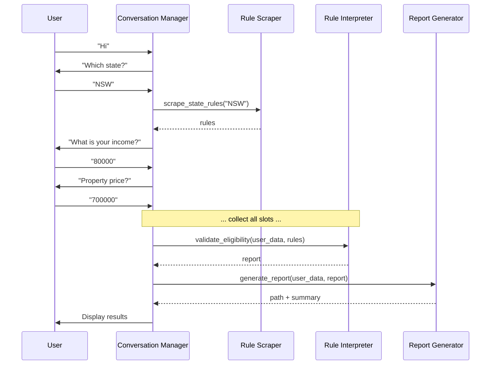

# Agent System Documentation

## Overview

This project uses an **agent-based architecture** where four autonomous agents collaborate to provide eligibility assessment for the First Home Buyer Grant.

## Agent Registry

### 1. Rule Scraper Agent

**Module:** `src.agents.rule_scraper.RuleScraper`

**Responsibilities:**
- Fetch eligibility rules from government websites
- Cache rules locally for offline/demo use
- Handle multiple states (NSW, VIC, QLD, WA)

**Public Interface:**
```python
scraper = RuleScraper(data_path="src/data/")
rules = scraper.scrape_state_rules("NSW")
```

**Known Limitations:**
- Demo mode returns static JSON (real scraping stubbed)
- Rate limiting enforced via time.sleep(2)

**Dependencies:** beautifulsoup4, requests

---

### 2. Rule Interpreter Agent

**Module:** `src.agents.rule_interpreter.RuleInterpreter`

**Responsibilities:**
- Validate user inputs against scraped rules
- Produce EligibilityReport with status and details

**Public Interface:**
```python
interpreter = RuleInterpreter(rules)
report = interpreter.validate_eligibility(user_data)
```

**Validation Categories:**
1. Income cap
2. Property price cap
3. First home buyer status
4. Citizenship/residency status
5. Residency intention
6. Property type (new vs existing)

**Outputs:** `EligibilityReport` dataclass

**Extensibility:** Add new validation by extending `_check_*` methods

---

### 3. Conversation Manager Agent

**Module:** `src.agents.conversation_manager.ConversationManager`

**Responsibilities:**
- Manage multi-turn dialogue state
- Coordinate between other agents
- Store user profile data
- Determine next bot prompt

**Public Interface:**
```python
manager = ConversationManager()
manager.process_input("NSW")     # Returns bot message
status = manager.get_summary()  # Current state snapshot
```

**State Machine:** 10 states from START → COMPLETE

**Slots Used:**
- `state`, `income`, `property_price`
- `first_home_buyer`, `citizenship_status`
- `will_reside`, `property_is_new`

**Resets on:** "restart" command

---

### 4. Report Generator Agent

**Module:** `src.agents.reporter.ReportGenerator`

**Responsibilities:**
- Format eligibility results for user consumption
- Generate Markdown, HTML, and (optionally) PDF reports
- Include next steps and sources

**Public Interface:**
```python
generator = ReportGenerator()
path = generator.generate_report(user_profile, eligibility_report, format="markdown")
card = generator.generate_summary_card(user_profile, report)  # Compact version
```

**Outputs:**
- Files saved to `reports/` directory
- Timestamped filenames to avoid collisions

**Templates:** Jinja2 (optional) or inline generation

---

## Agent Collaboration Protocol

### Sequence Diagram



### Data Handoffs

| Agent | Receives From | Provides To | Data Format |
|-------|--------------|-------------|-------------|
| Rule Scraper | - | Conversation Manager | `Dict` |
| Rule Interpreter | Conversation Manager → Rules | Conversation Manager | `EligibilityReport` |
| Report Generator | Conversation Manager | Conversation Manager | `str` filepath |

---

## Error Propagation

 Agents handle errors locally and propagate via:

- **Return `None`** - RuleScraper returns `None` on complete failure
- **Exception bubbling** - Unexpected errors bubble to Conversation Manager
- **Slot status flags** - `eligibility_status` slot records state

Error messages displayed to user are **friendly**, details logged with stack traces.

---

## State Persistence

- **Rasa slots** - primary storage during conversation
- **In-memory UserProfile** - conversation_manager instance
- **Filesystem cache** - rules JSON in `src/data/`
- **Report files** - written to `reports/`

No database required (for now).

---

## Extending Agents

### Adding a New Agent

1. Create `src/agents/new_agent.py`
2. Define class with single responsibility
3. Write unit tests in `tests/test_new_agent.py`
4. Integrate into `conversation_manager.py` or `actions.py`
5. Update `__init__.py` if needed

### Adding a New Validation Rule

1. Add rule to `src/data/nsw_rules.json`
2. Implement `_check_<rule>()` in `RuleInterpreter`
3. Update form in `domain.yml` (if collecting)
4. Add training examples to `nlu.yml`

---

## Logging Convention

All agents use Python's `logging` module:

```python
import logging
logger = logging.getLogger(__name__)

logger.debug("Detailed trace")
logger.info("Normal operation")
logger.warning("Unexpected but non-critical")
logger.error("Failure, but continuing")
```

Run with `--log-level DEBUG` to see all messages.

---

## Testing Strategy

Each agent gets its own test file:

- `tests/test_rule_scraper.py`
- `tests/test_rule_interpreter.py`
- `tests/test_conversation_manager.py`
- `tests/test_reporter.py`

Integration tests weave multiple agents together.

Use `pytest -v` to run all tests.

---

## Future Agent Ideas

- **Property Lookup Agent** - Fetch real-time property prices via API
- **Document Generator Agent** - Create pre-filled application forms
- **Notification Agent** - Send email/SMS reminders
- **Comparison Agent** - Multi-state comparison view
- **Eligibility Tracker Agent** - Monitor rule changes

---

*This agent system is designed to be modular, testable, and replaceable.*
