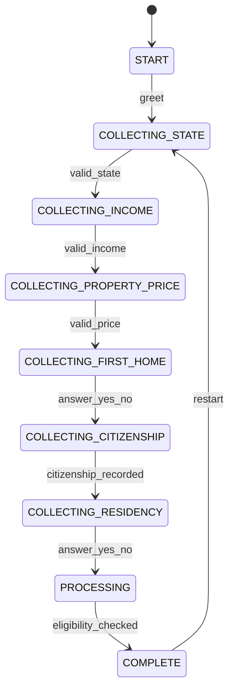
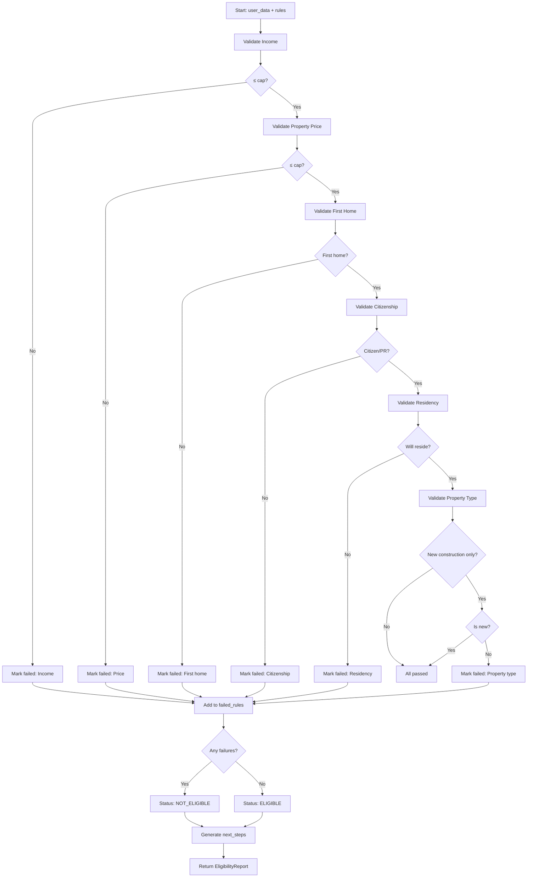

# System Architecture

## Overview

The FHBG Eligibility Bot uses a modular, agent-based architecture designed for:

- **Separation of concerns** - Each agent has a single, well-defined responsibility
- **Autonomous collaboration** - Agents can operate independently and be composed
- **Extensibility** - Easy to add new states, rules, or features
- **Maintainability** - Clear interfaces between components
- **Testability** - Each agent unit-tested in isolation

## Architecture Diagram

### High-Level Component View

```mermaid
graph TB
    subgraph "Frontend Layer"
        CLI[CLI Interface]
        WEB[Rasa Web UI]
        NB[Jupyter Notebook]
    end

    subgraph "API Layer"
        CM[Conversation Manager]
        ACT[Custom Rasa Actions]
    end

    subgraph "Agent Layer"
        RS[Rule Scraper Agent]
        RI[Rule Interpreter Agent]
        RG[Report Generator Agent]
    end

    subgraph "Data Layer"
        CACHE[Rule Cache - JSON Files]
        SOURCE[Government Websites (NSW Revenue, SRO VIC, etc.)]
    end

    CLI --> CM
    WEB --> ACT
    NB --> CM
    ACT --> CM

    CM --> RS
    CM --> RI
    CM --> RG

    RS --> SOURCE
    RS --> CACHE
    RI --> RS
    RG --> RI
```

## Agent Deep Dive

### 1. Rule Scraper Agent (`src/agents/rule_scraper.py`)

**Responsibility:** Fetch and cache eligibility rules from authoritative sources.

**Inputs:**
- `state: str` - State abbreviation (NSW, VIC, QLD, WA)
- `force_refresh: bool` - Optional override of cache

**Outputs:**
- `Dict` containing structured rule data:
  ```python
  {
      "state": "NSW",
      "grant_name": "First Home Buyer Choice",
      "rules": {
          "income_cap": 150000,
          "property_price_cap": 1500000,
          "first_home_buyer_required": True,
          ...
      },
      "sources": ["https://..."],
      "effective_date": "2024-01-01"
  }
  ```

**Tools & Libraries:**
- `requests` + `BeautifulSoup` - Web scraping (for production use)
- `json` - Serialization/deserialization
- `logging` - Activity tracking
- `time.sleep()` - Polite rate limiting

**Design Pattern:** Cache-Aside + Strategy

- If cached JSON exists and is fresh → load from disk
- If not → scrape website → parse → cache → return
- Each state has its own `_scrape_<state>_rules()` method

**Error Handling:**
- FileNotFoundError → try scraping
- JSONDecodeError → log and return None
- Network error → fallback to cache if available
- Unsupported state → return None with clear message

**Logger:** `src.agents.rule_scraper`

---

### 2. Rule Interpreter Agent (`src/agents/rule_interpreter.py`)

**Responsibility:** Validate user eligibility against scraped rules.

**Inputs:**
- `user_data: Dict` - Collected user information
- `rules: Dict` - Rules from RuleScraper

**Outputs:**
- `EligibilityReport` dataclass:
  ```python
  EligibilityReport(
      status=EligibilityStatus.ELIGIBLE | NOT_ELIGIBLE,
      grant_amount=10000,
      passed_rules=[...],
      failed_rules=[ValidationResult(...)],
      missing_requirements=[...],
      next_steps=[...],
      sources=[...],
  )
  ```

**Validation Rules (Current Implementation):**
1. Income ≤ income_cap
2. Property price ≤ property_price_cap
3. First home buyer status (if required)
4. Citizenship/residency status (if required)
5. Residency intention (must live in property)
6. Property type (new construction only, if required)

**Design Pattern:** Chain of Responsibility + Composite

- Each rule check is a separate method
- All checks accumulate results
- Final status derived from aggregate of passed/failed

**Algorithm:**
```
FOR each validation rule:
    execute check
    IF passed: add to passed_rules
    ELSE: add ValidationResult to failed_rules
IF failed_rules NOT EMPTY:
    status = NOT_ELIGIBLE
    missing_requirements = formatted failure messages
ELSE:
    status = ELIGIBLE
    missing_requirements = []
```

**Extension Points:** Adding a new rule requires:
- Adding rule key to rules JSON
- Adding parameter to rules dict
- Implementing `_check_<rule>()` method
- Calling it from `validate_eligibility()`

---

### 3. Conversation Manager Agent (`src/agents/conversation_manager.py`)

**Responsibility:** Orchestrate chatbot conversation flow and state management.

**State Machine:**



**Core Data Structures:**

```python
@dataclass
class UserProfile:
    state: Optional[str]
    income: Optional[float]
    property_price: Optional[float]
    first_home_buyer: Optional[bool]
    citizenship_status: Optional[str]
    will_reside: Optional[bool]
    property_is_new: Optional[bool]
```

**Responsibilities:**
- Maintain conversation state (state machine)
- Store collected user data in `UserProfile`
- Route user inputs to appropriate handler based on current state
- Coordinate between RuleScraper, RuleInterpreter, and ReportGenerator
- Generate bot responses

**Message Flow:**
1. User inputs message
2. `process_input()` routes to state handler (e.g., `_handle_income_input`)
3. Handler validates and stores data
4. Advances to next state
5. Returns bot prompt for next question

**Input Normalization:**
- State names: "NSW", "New South Wales", "nsw" → "NSW"
- Booleans: "yes", "y", "true", "1" → True
- Numbers: strip "$" and "," before parsing

**Design Pattern:** State Machine + Mediator

---

### 4. Report Generator Agent (`src/agents/reporter.py`)

**Responsibility:** Generate user-friendly eligibility reports in multiple formats.

**Formats Supported:**
- **Markdown** - for chat display and CLI
- **HTML** - for web display and PDF conversion
- (Optional) **PDF** - via WeasyPrint

**Report Contents:**
1. Header with timestamp
2. User's details table
3. Eligibility status (Eligible/Not Eligible)
4. Grant amount
5. List of passed/failed criteria
6. Missing requirements (if any)
7. Actionable next steps
8. Source attribution

**Design Pattern:** Template Method

- Base report structure common to all formats
- Format-specific rendering via `_generate_<format>()`
- Convenience method `generate_report()` dispatches to correct renderer

**Jinja2 Templates (Optional):**
- `report.html.j2` - HTML template
- `report.md.j2` - Markdown template (fallback to inline)

**Output Filename Pattern:**
```
reports/eligibility_report_YYYYMMDD_HHMMSS.{md,html,pdf}
```

---

## Rasa Integration

### Custom Actions (`src/chatbot/actions.py`)

Three primary actions bridge Rasa with our agent layer:

1. **ActionCheckEligibility** - The main action invoked when form completes
   - Extracts all slot values
   - Calls `RuleScraper` → `RuleInterpreter`
   - Stores result in `eligibility_report` slot
   - Displays summary to user

2. **ActionGenerateReport** - Generates downloadable report
   - Reads from `eligibility_report` slot
   - Calls `ReportGenerator`
   - Sends file path and full report text

3. **ActionResetSlots** - Resets conversation for new query

### Rasa Configuration Files

| File | Purpose |
|------|---------|
| `domain.yml` | Declares intents, entities, slots, responses, forms, actions |
| `nlu.yml` | Training examples for intent classification and entity extraction |
| `rules.yml` | Rule-based conversation patterns (no ML needed) |
| `stories.yml` | Example conversations for training policy |
| `config.yml` | NLU pipeline and policy configuration |
| `endpoints.yml` | Action server URL configuration |

### Form-Driven Dialogue

The eligibility check uses a **Rasa Form** (`eligibility_form`) with required slots:

```
Form: eligibility_form
Slots: state, income, property_price, first_home_buyer,
       citizenship_status, will_reside, property_is_new
```

Form behavior:
- Rasa auto-prompts for each required slot
- Validates with `from_entity` mappings (extracted from user messages via NLU)
- Submits when all slots filled
- Triggers `action_check_eligibility`

---

## Data Flow

### Full Conversation Scenario

```python
# User starts chat
User: "Hi"

Bot: "🏡 Welcome... Which state are you buying in?"

# User provides state
User: "NSW"
└─> form activates, stores "NSW" in state slot

Bot: "What is your annual household income?"

# User provides income
User: "80000"
└─> stores 80000 in income slot

Bot: "What is the property price?"

# ... continues until all slots filled ...

# Form submits
form: all slots valid → next action: action_check_eligibility

ActionCheckEligibility:
  1. RuleScraper.scrape_state_rules("NSW") → nsw_rules
  2. RuleInterpreter(nsw_rules).validate_eligibility(user_data) → report
  3. SlotSet(eligibility_report, serialized(report))
  4. Display summary to user

Bot: "✅ You are eligible! Grant amount: $10,000..."

# User requests report
User: "show me the report"

ActionGenerateReport:
  1. Load report from eligibility_report slot
  2. ReportGenerator.generate_report() → markdown
  3. Send report text + file path

Bot: "Here's your report: ..."
```

### Rule Scraping & Caching Flow

```
┌─────────────┐
│ Start scrape│
└──────┬──────┘
       ▼
┌─────────────────────┐
│ Check cache exists? │─────Yes──┐
└─────────┬───────────┘          │
          No                     │
          │                      │
          ▼                      │
┌─────────────────────┐         │
│ Cache age < TTL?    │─────Yes──┤
└─────────┬───────────┘          │
          No                     │
          │                      ▼
          ▼           ┌─────────────────────┐
┌──────────────────┐ │ Load from cache     │
│ Scrape website   │ └─────────┬───────────┘
├──────────────────┤           │
│ Polite delay     │           │
│   time.sleep(2)  │           │
└────────┬─────────┘           │
         │                     │
         ▼                     │
┌──────────────────┐          │
│ Parse HTML       │          │
│ with BeautifulSoup│         │
└────────┬─────────┘          │
         │                     │
         ▼                     │
┌──────────────────┐          │
│ Extract rules    │          │
│ to dict          │          │
└────────┬─────────┘          │
         │                     │
         ▼                     │
┌──────────────────┐          │
│ Save to cache    │──────────┘
│ as JSON          │
└──────────────────┘
```

### Eligibility Validation Flow



---

## Security & Privacy

### No PII Storage
- All user data kept in-memory only
- Slots reset after conversation ends
- No database of personal information

### Input Sanitization
- Numbers validated before conversion
- State names normalized to limited set
- Strings escaped in report generation

### Rate Limiting
- Scraping delays: 2 seconds between requests
- Cache TTL: 24 hours avoids repeated hits
- Retry logic with exponential backoff (future)

### Environment Variables
- No hardcoded secrets
- `.env` file (gitignored) holds configuration
- `.env.example` documents all variables

---

## Security & Privacy

### Path Traversal Protection

All file system operations are restricted to the project directory:

```python
# RuleScraper validates data_path
self.data_path = Path(data_path).resolve()
if not self.data_path.is_relative_to(project_root):
    raise ValueError("data_path must be within project directory")

# ReportGenerator validates output_dir
output_path = Path(self.config.output_dir).resolve()
if not output_path.is_relative_to(allowed_root):
    raise ValueError("output_dir must be within reports/")
```

**Test override:** Constructors accept `validate_paths=False` for unit tests using temporary directories.

### Input Sanitization

User inputs are validated at multiple layers:

| Input | Validation | Range |
|-------|------------|-------|
| Income | `validate_financial_input()` | 0 ≤ income ≤ $10,000,000 |
| Property price | `validate_financial_input()` | 0 ≤ price ≤ $50,000,000 |
| State | `normalize_state()` | Only NSW/VIC/QLD/WA accepted |
| Text fields | `sanitize_string()` | Max length 200 chars, control chars stripped |

### Data Privacy

- **No PII stored** — User profiles kept in-memory only; reset on conversation end.
- **No logging of sensitive data** — Logs contain only numeric values without identifiers.
- **Cache files** — Cached rules are public government data; no personal info.
- **Reports** — Generated reports contain eligibility details only (no names, addresses).

### Secrets & Configuration

- `.env` file gitignored; contains only non-sensitive config (Scrape delays, TTL, log level).
- No API keys or credentials required for demo mode.
- For production scraping, consider rate limiting and IP rotation.

### Dependency Security

- **Rasa 3.6.0** is EOL (Sep 2022). Known vulnerabilities may exist.
  - **Recommendation:** Upgrade to Rasa 3.7.x+ for production deployments.
- Run `safety check` regularly to audit dependencies.
- Consider using `pip-compile` or `poetry` for exact version pinning.

### Deployment Hardening

When deploying to production:

1. Run application as non-root user
2. Enable HTTPS everywhere (TLS 1.3)
3. Set `LOG_LEVEL=WARNING` to reduce log noise
4. Mount `reports/` as read-only except for app user
5. Use reverse proxy (nginx) with rate limiting
6. Regular security updates for OS and Python

> **Note:** This is a demo project. For production use, implement authentication, encryption at rest, and dependency upgrades.

---

## Error Handling Strategy

### Graceful Degradation

| Failure Mode | Response |
|-------------|----------|
| State rules unavailable | Fall back to cached rules if available, else "Unable to load rules" message |
| Scrape timeout | Use cached data, notify user "Using cached rules" |
| Invalid user input | Re-prompt with specific error message |
| Form validation error | Clearly identify which slots are missing/invalid |
| Action server crash | Log stack trace, return user-friendly message |
| Missing dependency | Clear error message about installing requirements |

### Logging

All agents log at appropriate levels:

- `INFO` - Normal operations (scraping, validation results)
- `DEBUG` - Detailed steps (slot values, intermediate data)
- `WARNING` - Missing optional fields, cache misses
- `ERROR` - Scraping failures, JSON parse errors, action exceptions

Log format: `TIMESTAMP - AGENT_NAME - LEVEL - MESSAGE`

---

## Performance Considerations

### Caching Strategy
- Rules cached per-state as JSON files
- TTL configurable via `RULE_CACHE_TTL` (default: 24h)
- Automatic refresh on expiry (background)

### Memory Usage
- Each conversation: ~1KB of user profile data
- Report objects: lightweight dataclasses
- No large objects retained after session

### Scalability
- Single-threaded by default (CLI/Rasa)
- Can be parallelized: multiple concurrent conversations don't interfere
- Stateless agents (except RuleScraper cache) → horizontally scalable

---

## Future Enhancements

### RAG Integration
Future version can replace static JSON with retrieval-augmented generation:

```python
# Load rules from vector store
from langchain.vectorstores import FAISS
from langchain.embeddings import OpenAIEmbeddings

vectorstore = FAISS.load_local("rules_index")
relevant_rules = vectorstore.similarity_search("NSW income cap")
```

### Real-time API Integration
```python
# Check property price automatically
import requests

def get_property_price(address):
    resp = requests.get(f"https://api.domain.com.au/v1/properties?address={address}")
    return resp.json()["price"]
```

### Multi-User Sessions
- Store conversations in Redis/memcached
- User accounts with JWT
- History of eligibility checks

---

## Deployment Architecture (Production)

```
┌─────────────┐    HTTPS    ┌──────────────┐    HTTP    ┌─────────────┐
│   Browser   │◄──────────►│   Nginx      │◄──────────►│  Rasa       │
│   / Web     │            │   (reverse   │            │  Server     │
│   Mobile    │            │   proxy)     │            │             │
└─────────────┘            └──────────────┘            └─────────────┘
                                                           │
                                                           │
                                               ┌───────────▼────────────┐
                                               │   Action Server        │
                                               │   (Custom Actions)     │
                                               └───────────┬────────────┘
                                                           │
                                               ┌───────────▼────────────┐
                                               │   Rule Scraper Agent   │
                                               │   (with cache)         │
                                               └───────────┬────────────┘
                                                           │
                                                           │ cache
                                               ┌───────────▼────────────┐
                                               │   JSON Cache           │
                                               │   (mounted volume)     │
                                               └────────────────────────┘
```

---

## References

- [Rasa Documentation](https://rasa.com/docs/)
- [BeautifulSoup Documentation](https://www.crummy.com/software/BeautifulSoup/bs4/doc/)
- [Australian Government - First Home Grants](https://www.firsthome.gov.au/)
- [NSW Revenue - First Home Buyer](https://www.revenue.nsw.gov.au/grants-schemes/first-home-buyer)
